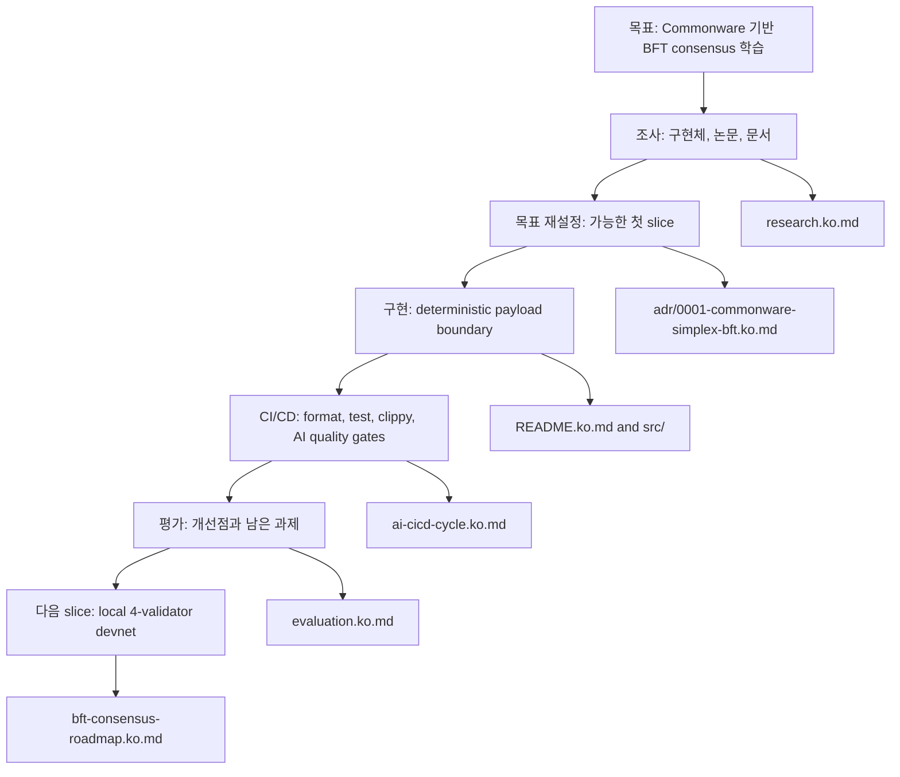
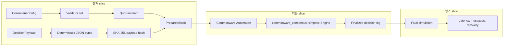

# 문서

English version: `README.md`

이 문서는 단순 파일 목록이 아니라 구현 과정을 따라 읽을 수 있도록 구성합니다.

## 읽는 순서

## 문서 목록

| 목적 | English | Korean |
|---|---|---|
| 레포 개요 | [README.md](../README.md) | [README.ko.md](../README.ko.md) |
| 문서 인덱스 | [README.md](README.md) | [README.ko.md](README.ko.md) |
| 조사 기록 | [research.md](research.md) | [research.ko.md](research.ko.md) |
| 아키텍처 결정 | [0001-commonware-simplex-bft.md](adr/0001-commonware-simplex-bft.md) | [0001-commonware-simplex-bft.ko.md](adr/0001-commonware-simplex-bft.ko.md) |
| 구현 로드맵 | [bft-consensus-roadmap.md](bft-consensus-roadmap.md) | [bft-consensus-roadmap.ko.md](bft-consensus-roadmap.ko.md) |
| CI/CD cycle | [ai-cicd-cycle.md](ai-cicd-cycle.md) | [ai-cicd-cycle.ko.md](ai-cicd-cycle.ko.md) |
| 결과 평가 | [evaluation.md](evaluation.md) | [evaluation.ko.md](evaluation.ko.md) |
| 시각화 가이드 | [visualization.md](visualization.md) | [visualization.ko.md](visualization.ko.md) |

## 구현 방향

## 시각화 규칙

- architecture, sequence, roadmap은 Markdown 안의 Mermaid를 우선 사용합니다.
- 정적 Mermaid로 행동을 설명하기 어려울 때만 GIF/SVG/HTML artifact를 생성합니다.
- 생성된 시각 자료는 `docs/assets/` 아래에 둡니다.
- GitHub Markdown 안에서 JavaScript 실행에 의존하지 않습니다. 애니메이션에 JavaScript가 필요하면 HTML artifact로 링크하거나 GIF/SVG로 기록합니다.
