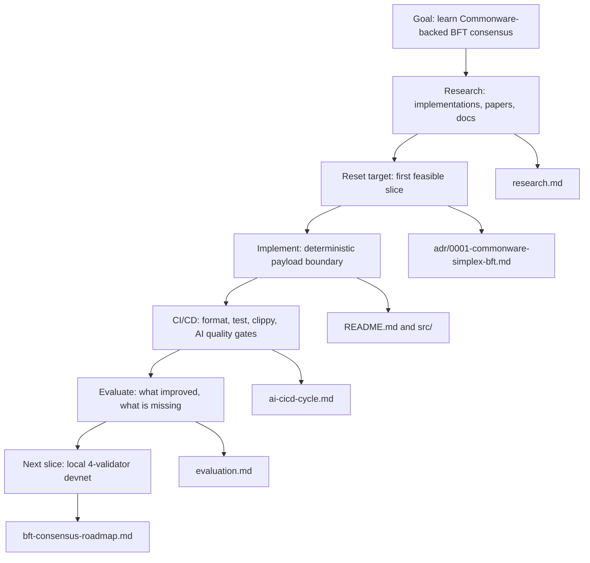
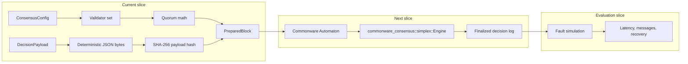

# Documentation

Korean version: `README.ko.md`

This documentation is organized around the implementation journey, not just file storage.

## Reading Path

## Documents

| Purpose | English | Korean |
|---|---|---|
| Repository overview | [README.md](../README.md) | [README.ko.md](../README.ko.md) |
| Documentation index | [README.md](README.md) | [README.ko.md](README.ko.md) |
| Research notes | [research.md](research.md) | [research.ko.md](research.ko.md) |
| Architecture decision | [0001-commonware-simplex-bft.md](adr/0001-commonware-simplex-bft.md) | [0001-commonware-simplex-bft.ko.md](adr/0001-commonware-simplex-bft.ko.md) |
| Implementation roadmap | [bft-consensus-roadmap.md](bft-consensus-roadmap.md) | [bft-consensus-roadmap.ko.md](bft-consensus-roadmap.ko.md) |
| Concrete milestones | [milestones.md](milestones.md) | [milestones.ko.md](milestones.ko.md) |
| CI/CD cycle | [ai-cicd-cycle.md](ai-cicd-cycle.md) | [ai-cicd-cycle.ko.md](ai-cicd-cycle.ko.md) |
| Result evaluation | [evaluation.md](evaluation.md) | [evaluation.ko.md](evaluation.ko.md) |
| Visualization guide | [visualization.md](visualization.md) | [visualization.ko.md](visualization.ko.md) |

## Implementation Direction

The exact files, Rust APIs, CLI commands, tests, and acceptance criteria are in [milestones.md](milestones.md).

## Visualization Policy

- Use Mermaid in Markdown for architecture, sequence, and roadmap diagrams.
- Use generated GIF/SVG/HTML artifacts only when a static Mermaid diagram cannot explain the behavior.
- Keep generated visual assets under `docs/assets/`.
- Do not rely on JavaScript execution inside GitHub Markdown. If an animation needs JavaScript, link to an HTML artifact or record it as GIF/SVG.
