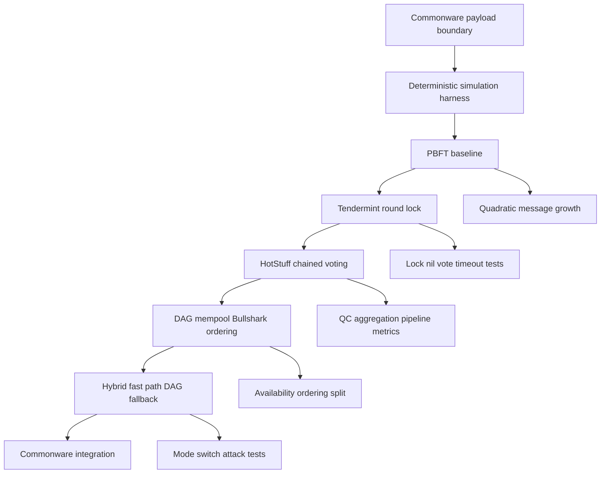

# BFT Consensus 구현·실험 로드맵

작성일: 2026-05-31

English version: `bft-consensus-roadmap.md`

## 목표

`https://heru.ragdoll-bigeye.ts.net/lab/blog/blockchain?sub=bft-consensus`의 BFT 비교 내용을 실험 가능한 lab으로 옮긴다.

이 lab의 목표는 production chain을 바로 만드는 것이 아니다. PBFT 계열에서 HotStuff 계열, DAG BFT, 하이브리드 BFT로 이어지는 개선 아이디어를 작은 Rust 실험으로 재현하고, 같은 workload와 fault model에서 latency, throughput, message count, finality behavior를 비교하는 것이다.

## 블로그 기준 요약

현재 블로그의 `Consensus (BFT 비교)` 섹션은 다음 흐름을 기준으로 한다.

- PBFT: prepare/commit all-to-all로 normal path `O(n^2)`, view-change 비용이 커짐.
- Tendermint/CometBFT: propose/prevote/precommit round와 lock/polka 규칙으로 production 검증성이 높음.
- HotStuff: leader가 vote를 모아 linear communication과 chained commit을 제공.
- HotStuff-2: two-phase responsive BFT로 happy-path latency를 줄임.
- Narwhal/Bullshark: data availability와 ordering을 분리해 DAG 위에서 deterministic ordering.
- Mysticeti: DAG 기반 leaderless fast commit path로 latency와 validator CPU 부담을 낮춤.
- Autobahn: leader fast path와 DAG fallback을 결합해 latency/throughput trade-off를 완화.
- Avalanche/Snowball: deterministic quorum BFT가 아닌 repeated sub-sampling 기반 probabilistic finality.
- Filecoin F3/GossiPBFT: longest-chain 계열 위에 BFT finality layer를 retrofit하는 사례.

## 로드맵 플로우

## 1차 구현 범위

이미 구현된 slice는 다음 경계다.

- validator set 모델링
- `f = floor((n - 1) / 3)` 및 `2f + 1` quorum 계산
- deterministic `DecisionPayload` 직렬화
- proposal 전 payload hash 생성
- Commonware Simplex 연결 지점 문서화

다음 slice부터는 실험 가능한 consensus harness를 만든다.

정확한 파일 경로, Rust API, 테스트명, CLI 명령, 완료조건은 [milestones.ko.md](milestones.ko.md)에 둔다.

## 구현 순서

1. **Deterministic simulation harness**
   - 노드, 네트워크 지연, drop, byzantine behavior를 in-memory event loop로 모델링한다.
   - 먼저 cryptography 없이 vote identity와 quorum math만 검증한다.
   - 측정값: decided height, finality steps, message count, timeout count.

2. **PBFT baseline**
   - `pre-prepare -> prepare -> commit`을 구현한다.
   - normal path `O(n^2)` 메시지 증가가 n=4/7/10/25에서 어떻게 나타나는지 측정한다.
   - byzantine leader equivocation과 slow replica를 fault case로 둔다.

3. **Tendermint-style round/lock**
   - `propose -> prevote -> precommit -> commit`과 lock/unlock 규칙을 구현한다.
   - nil vote, proposer timeout, higher-round polka를 테스트한다.
   - CometBFT spec과 비교해 safety invariant를 테스트로 고정한다.

4. **HotStuff-style chained voting**
   - QC, parent link, 3-chain commit rule을 구현한다.
   - PBFT/Tendermint 대비 message count와 pipelining 효과를 비교한다.
   - 이후 HotStuff-2 two-phase 변형을 실험 branch로 둔다.

5. **DAG mempool + Bullshark-style ordering**
   - validator별 batch vertex와 round certificate를 만든다.
   - data availability DAG와 ordering layer를 분리한다.
   - throughput 우위와 latency penalty를 같은 workload에서 비교한다.

6. **Hybrid experiment**
   - normal path는 leader/HotStuff-style fast path로 처리하고, congestion/fault 시 DAG path로 fallback한다.
   - Autobahn 계열 아이디어처럼 mode switch가 성능을 올리는지, 공격자가 mode flip을 유도할 때 악화되는지 측정한다.

## 실험 매트릭스

| 축 | 값 |
| --- | --- |
| validator count | 4, 7, 10, 25 |
| fault count | 0, 1, f |
| fault type | crashed leader, slow replica, equivocating leader, delayed quorum, message drop |
| network | LAN-like fixed delay, WAN-like jitter, partial synchrony GST 전/후 |
| workload | 1 tx/block, 100 tx/block, large batch |
| metrics | finality latency, committed blocks/sec, messages/decision, bytes/decision, timeout count, view/round changes |

## 아이디어 원천

| 소스 | 핵심 아이디어 | 실험으로 옮길 것 |
| --- | --- | --- |
| PBFT, Castro & Liskov, 1999, https://www.usenix.org/conference/osdi-99/presentation/practical-byzantine-fault-tolerance | practical BFT state-machine replication, prepare/commit quorum | baseline protocol, all-to-all message cost |
| Tendermint/CometBFT consensus spec, https://docs.cometbft.com/main/spec/consensus/ | propose/prevote/precommit, lock, PoLC, validator signing | lock safety invariant, nil vote, proposer timeout |
| HotStuff, 2018/2019, https://arxiv.org/abs/1803.05069 | linear view change, chained voting, QC | chained commit, leader aggregation, pipelining |
| HotStuff-2, 2023, https://eprint.iacr.org/2023/397.pdf | two-phase responsive BFT | 3-phase vs 2-phase happy-path latency comparison |
| Jolteon and Ditto, 2021, https://arxiv.org/abs/2106.10362 | network-adaptive consensus with asynchronous fallback | fallback behavior under delayed network |
| Narwhal and Tusk, 2021/2022, https://arxiv.org/abs/2105.11827 | reliable transaction dissemination separated from ordering | mempool DAG vs consensus ordering split |
| Bullshark, 2022, https://arxiv.org/abs/2201.05677 | practical DAG BFT ordering on Narwhal | zero-extra-communication ordering experiment |
| Shoal, 2023, https://arxiv.org/abs/2306.03058 | leader reputation and pipelining for Narwhal/Bullshark latency | reputation heuristic and pipeline depth sweep |
| Mysticeti, 2024, https://docs.sui.io/paper/mysticeti.pdf | low-latency DAG consensus with fast commit path | leaderless fast commit path sketch and latency target |
| Autobahn, 2024, https://www.cs.cornell.edu/~fsp/reports/Autobahn__SOSP24_CR.pdf | seamless high-speed BFT via hybrid fast/fallback paths | mode switch policy and attack surface test |
| Bullshark on Narwhal workflow analysis, 2025, https://arxiv.org/abs/2507.04956 | implementation-level decomposition of Narwhal/Bullshark workflow | module boundary checklist for DAG implementation |
| Commonware Simplex, https://eprint.iacr.org/2023/463.pdf and https://docs.rs/commonware-consensus/latest/commonware_consensus/simplex/ | practical Rust BFT primitive already usable in lab | real implementation path after simulator validates assumptions |

## 테스트 원칙

- Safety는 property test 성격으로 검증한다: honest node 두 개가 같은 height에서 다른 block을 commit하면 실패.
- Liveness는 deterministic scheduler에서 GST 이후 eventually commit으로 검증한다.
- 성능 비교는 wall-clock보다 simulated step/message count를 먼저 사용한다.
- 실제 Commonware integration은 simulator invariant가 안정된 뒤 붙인다.
- 모든 개선 아이디어는 baseline 대비 어떤 metric을 개선하는지 먼저 적고 구현한다.

## 다음 PR 단위

1. `sim` module 추가: node id, message, scheduler, network delay/drop model.
2. PBFT baseline 구현 및 4-validator safety/liveness tests.
3. `bench` 또는 snapshot test로 n별 message count 기록.
4. README/evaluation에 PBFT baseline 결과 추가.
