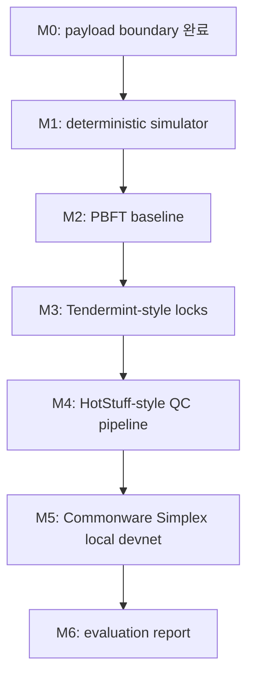

# 구체적 마일스톤

English version: `milestones.md`

이 문서는 로드맵을 실제 구현 가능한 PR 단위로 쪼갭니다. 각 slice는 파일 경로, 타입/API, 테스트명, CLI, 완료조건을 포함해야 합니다.

## 마일스톤 맵



## M0: Payload Boundary

상태: 완료.

파일:

- `src/lib.rs`
- `src/main.rs`
- `examples/decision-payload.json`

구현된 타입과 함수:

- `Validator`
- `ConsensusConfig`
- `DecisionPayload`
- `PreparedBlock`
- `ConsensusConfig::fault_tolerance`
- `ConsensusConfig::quorum_threshold`
- `ConsensusConfig::prepare_payload`
- `implementation_runbook`

테스트:

- `commonware_dependency_is_part_of_the_boundary`
- `quorum_uses_two_f_plus_one`
- `rejects_too_small_validator_sets`
- `prepares_stable_payload_hash`

완료조건:

- `cargo test --locked` 통과.
- `cargo run -- init-config`가 4-validator config를 출력.
- `cargo run -- prepare --config <file> --payload examples/decision-payload.json`가 64자 payload hash를 출력.

## M1: Deterministic Simulator

목표: real p2p를 붙이기 전에 protocol idea를 비교할 수 있는 deterministic in-memory event loop를 만든다.

추가할 파일:

- `src/sim/mod.rs`
- `src/sim/types.rs`
- `src/sim/scheduler.rs`
- `src/sim/network.rs`
- `src/sim/metrics.rs`
- `tests/sim_determinism.rs`

타입과 API:

- `NodeId(u32)`
- `Height(u64)`
- `Round(u64)`
- `Step(u64)`
- `Message { from: NodeId, to: NodeId, height: Height, round: Round, kind: MessageKind }`
- `MessageKind::{Proposal, Vote, Timeout, Certificate}`
- `NetworkRule::{Delay { from, to, steps }, Drop { from, to }, Partition { group_a, group_b }}`
- `Scheduler::new(seed: u64)`
- `Scheduler::send(message)`
- `Scheduler::run_until(predicate, max_steps)`
- `Metrics { messages_sent, messages_delivered, timeouts, decided_height }`

추가할 CLI:

```bash
cargo run -- simulate --protocol noop --validators 4 --seed 1 --max-steps 50
```

테스트:

- `sim_replays_same_transcript_for_same_seed`
- `sim_delays_messages_by_rule`
- `sim_drops_messages_by_rule`
- `sim_stops_at_max_steps`

완료조건:

- 같은 seed와 input은 byte-identical transcript를 만든다.
- delay/drop rule이 `Metrics`에 반영된다.
- 이 milestone에서는 consensus protocol을 구현하지 않는다.

## M2: PBFT Baseline

목표: 첫 baseline protocol을 구현하고 all-to-all message cost를 측정한다.

추가할 파일:

- `src/protocols/mod.rs`
- `src/protocols/pbft.rs`
- `tests/pbft_safety.rs`
- `tests/pbft_metrics.rs`

타입과 API:

- `PbftNode`
- `PbftConfig { validator_count, faulty_nodes, timeout_steps }`
- `PbftMessage::{PrePrepare, Prepare, Commit, ViewChange}`
- `PbftState::{Idle, Prepared, Committed}`
- `Protocol::on_message`
- `Protocol::tick`
- `Protocol::decision`

CLI:

```bash
cargo run -- simulate --protocol pbft --validators 4 --fault none --height 1
cargo run -- simulate --protocol pbft --validators 7 --fault slow-replica --seed 7
```

테스트:

- `pbft_commits_with_four_validators_and_no_faults`
- `pbft_commits_with_one_slow_replica`
- `pbft_rejects_conflicting_preprepare_from_leader`
- `pbft_never_commits_two_blocks_at_same_height`
- `pbft_message_count_grows_quadratically`

측정값:

- `messages/decision`
- `steps_to_commit`
- `timeouts`
- `view_changes`

완료조건:

- n=4, f=1에서 fault 없이 block 1개 commit.
- n=4에서 slow/crashed replica 1개를 견딤.
- equivocation test가 split commit을 만들지 않음.
- message count table을 `docs/evaluation.md`와 `docs/evaluation.ko.md`에 기록.

## M3: Tendermint-Style Round And Lock

목표: lock 및 nil-vote behavior가 있는 round-based protocol을 PBFT와 비교한다.

추가할 파일:

- `src/protocols/tendermint.rs`
- `tests/tendermint_lock.rs`
- `tests/tendermint_liveness.rs`

타입과 API:

- `TendermintNode`
- `TendermintMessage::{Proposal, Prevote, Precommit}`
- `Lock { round, block_hash }`
- `Polka { round, block_hash }`
- `RoundState::{Propose, Prevote, Precommit, Commit}`

CLI:

```bash
cargo run -- simulate --protocol tendermint --validators 4 --fault delayed-proposer --seed 11
```

테스트:

- `tendermint_locks_after_polka`
- `tendermint_unlocks_only_on_higher_round_polka`
- `tendermint_nil_votes_when_proposal_missing`
- `tendermint_commits_after_gst`

완료조건:

- lock safety invariant가 test로 고정됨.
- delayed proposer가 timeout과 higher round를 유발함.
- evaluation docs에 PBFT/Tendermint n=4/7 비교표가 추가됨.

## M4: HotStuff-Style QC Pipeline

목표: QC aggregation과 chained commit을 추가해 PBFT/Tendermint 대비 pipeline behavior를 비교한다.

추가할 파일:

- `src/protocols/hotstuff.rs`
- `tests/hotstuff_qc.rs`
- `tests/hotstuff_pipeline.rs`

타입과 API:

- `HotStuffNode`
- `BlockNode { height, view, parent, payload_hash }`
- `QuorumCertificate { view, block_hash, voters }`
- `HotStuffMessage::{Proposal, Vote, NewView}`
- `CommitRule::ThreeChain`

CLI:

```bash
cargo run -- simulate --protocol hotstuff --validators 7 --pipeline-depth 3 --seed 21
```

테스트:

- `hotstuff_forms_qc_with_two_f_plus_one_votes`
- `hotstuff_commits_on_three_chain`
- `hotstuff_view_change_preserves_safety`
- `hotstuff_pipeline_reduces_steps_per_decision`

완료조건:

- QC voter set이 `2f + 1` 기준으로 검증됨.
- three-chain commit rule이 test로 커버됨.
- evaluation docs에 PBFT/Tendermint/HotStuff message 및 step comparison이 추가됨.

## M5: Commonware Simplex Local Devnet

목표: simulator invariant가 안정된 뒤 application boundary를 실제 Commonware Simplex local devnet에 연결한다.

추가할 파일:

- `src/commonware_app.rs`
- `src/bin/validator.rs`
- `examples/devnet/validator-1.json`
- `examples/devnet/validator-2.json`
- `examples/devnet/validator-3.json`
- `examples/devnet/validator-4.json`
- `scripts/devnet-up.sh`
- `scripts/devnet-submit.sh`
- `tests/commonware_payload.rs`

타입과 API:

- `DecisionAutomaton`
- `DecisionLog`
- `DecisionVerifier`
- `FinalizedDecision`

CLI:

```bash
scripts/devnet-up.sh
scripts/devnet-submit.sh examples/decision-payload.json
cargo run -- runbook --config examples/devnet/validator-1.json
```

테스트:

- `commonware_payload_hash_matches_prepared_block`
- `decision_verifier_rejects_oversized_payload`
- `decision_log_appends_finalized_payload_once`

완료조건:

- local validator 4개가 시작됨.
- 하나의 `DecisionPayload`가 finalize되고 한 번만 append됨.
- validator 1개 restart가 finalized decision을 중복 append하지 않음.
- evaluation docs에 finality latency와 restart note가 추가됨.

## M6: Evaluation Report

목표: 개선 주장을 evidence로 바꾼다.

수정할 파일:

- `docs/evaluation.md`
- `docs/evaluation.ko.md`
- `docs/assets/*.svg`

필수 표:

| 표 | 필수 컬럼 |
|---|---|
| protocol comparison | protocol, n, f, fault, commit?, steps, messages, timeouts |
| implementation evidence | milestone, command, result, commit |
| improvement summary | baseline, change, improved metric, trade-off |

완료조건:

- 완료된 모든 milestone에 command와 result가 있다.
- 모든 improvement claim이 metric을 가리킨다.
- 모든 limitation에 next action이 있다.
