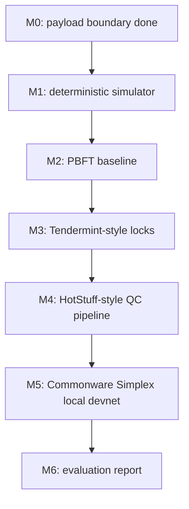

# Concrete Milestones

Korean version: `milestones.ko.md`

This file turns the roadmap into concrete implementation slices. Each slice is small enough to become one pull request.

## Milestone Map



## M0: Payload Boundary

Status: done.

Files:

- `src/lib.rs`
- `src/main.rs`
- `examples/decision-payload.json`

Implemented types and functions:

- `Validator`
- `ConsensusConfig`
- `DecisionPayload`
- `PreparedBlock`
- `ConsensusConfig::fault_tolerance`
- `ConsensusConfig::quorum_threshold`
- `ConsensusConfig::prepare_payload`
- `implementation_runbook`

Tests:

- `commonware_dependency_is_part_of_the_boundary`
- `quorum_uses_two_f_plus_one`
- `rejects_too_small_validator_sets`
- `prepares_stable_payload_hash`

Acceptance criteria:

- `cargo test --locked` passes.
- `cargo run -- init-config` emits a 4-validator config.
- `cargo run -- prepare --config <file> --payload examples/decision-payload.json` emits a 64-character payload hash.

## M1: Deterministic Simulator

Goal: create a deterministic in-memory event loop so protocol ideas can be compared before wiring real p2p.

Files to add:

- `src/sim/mod.rs`
- `src/sim/types.rs`
- `src/sim/scheduler.rs`
- `src/sim/network.rs`
- `src/sim/metrics.rs`
- `tests/sim_determinism.rs`

Types and APIs:

- `NodeId(u32)`
- `Height(u64)`
- `Round(u64)`
- `Step(u64)`
- `Message { from: NodeId, to: NodeId, height: Height, round: Round, kind: MessageKind }`
- `MessageKind::{Proposal, Vote, Timeout, Certificate}`
- `NetworkRule::{Delay { from, to, steps }, Drop { from, to }, Partition { group_a, group_b }}`
- `Scheduler::new(seed: u64)`
- `Scheduler::send(message)`
- `Scheduler::run_until(predicate, max_steps)`
- `Metrics { messages_sent, messages_delivered, timeouts, decided_height }`

CLI to add:

```bash
cargo run -- simulate --protocol noop --validators 4 --seed 1 --max-steps 50
```

Tests:

- `sim_replays_same_transcript_for_same_seed`
- `sim_delays_messages_by_rule`
- `sim_drops_messages_by_rule`
- `sim_stops_at_max_steps`

Acceptance criteria:

- Same seed and inputs produce byte-identical transcript output.
- Delay/drop rules are visible in `Metrics`.
- No consensus protocol is implemented in this milestone.

## M2: PBFT Baseline

Goal: implement the first real baseline protocol and measure its all-to-all message cost.

Files to add:

- `src/protocols/mod.rs`
- `src/protocols/pbft.rs`
- `tests/pbft_safety.rs`
- `tests/pbft_metrics.rs`

Types and APIs:

- `PbftNode`
- `PbftConfig { validator_count, faulty_nodes, timeout_steps }`
- `PbftMessage::{PrePrepare, Prepare, Commit, ViewChange}`
- `PbftState::{Idle, Prepared, Committed}`
- `Protocol::on_message`
- `Protocol::tick`
- `Protocol::decision`

CLI:

```bash
cargo run -- simulate --protocol pbft --validators 4 --fault none --height 1
cargo run -- simulate --protocol pbft --validators 7 --fault slow-replica --seed 7
```

Tests:

- `pbft_commits_with_four_validators_and_no_faults`
- `pbft_commits_with_one_slow_replica`
- `pbft_rejects_conflicting_preprepare_from_leader`
- `pbft_never_commits_two_blocks_at_same_height`
- `pbft_message_count_grows_quadratically`

Metrics:

- `messages/decision`
- `steps_to_commit`
- `timeouts`
- `view_changes`

Acceptance criteria:

- n=4, f=1 commits one block with no faults.
- n=4 tolerates one slow/crashed replica.
- equivocation test does not produce split commit.
- message count table is written to `docs/evaluation.md` and `docs/evaluation.ko.md`.

## M3: Tendermint-Style Round And Lock

Goal: compare PBFT with a round-based protocol that has lock and nil-vote behavior.

Files to add:

- `src/protocols/tendermint.rs`
- `tests/tendermint_lock.rs`
- `tests/tendermint_liveness.rs`

Types and APIs:

- `TendermintNode`
- `TendermintMessage::{Proposal, Prevote, Precommit}`
- `Lock { round, block_hash }`
- `Polka { round, block_hash }`
- `RoundState::{Propose, Prevote, Precommit, Commit}`

CLI:

```bash
cargo run -- simulate --protocol tendermint --validators 4 --fault delayed-proposer --seed 11
```

Tests:

- `tendermint_locks_after_polka`
- `tendermint_unlocks_only_on_higher_round_polka`
- `tendermint_nil_votes_when_proposal_missing`
- `tendermint_commits_after_gst`

Acceptance criteria:

- lock safety invariant is tested.
- delayed proposer causes timeout and higher round.
- evaluation docs compare PBFT and Tendermint for n=4/7.

## M4: HotStuff-Style QC Pipeline

Goal: add QC aggregation and chained commit to compare pipeline behavior against PBFT/Tendermint.

Files to add:

- `src/protocols/hotstuff.rs`
- `tests/hotstuff_qc.rs`
- `tests/hotstuff_pipeline.rs`

Types and APIs:

- `HotStuffNode`
- `BlockNode { height, view, parent, payload_hash }`
- `QuorumCertificate { view, block_hash, voters }`
- `HotStuffMessage::{Proposal, Vote, NewView}`
- `CommitRule::ThreeChain`

CLI:

```bash
cargo run -- simulate --protocol hotstuff --validators 7 --pipeline-depth 3 --seed 21
```

Tests:

- `hotstuff_forms_qc_with_two_f_plus_one_votes`
- `hotstuff_commits_on_three_chain`
- `hotstuff_view_change_preserves_safety`
- `hotstuff_pipeline_reduces_steps_per_decision`

Acceptance criteria:

- QC voter set is checked against `2f + 1`.
- Three-chain commit rule is covered by tests.
- evaluation docs include PBFT/Tendermint/HotStuff message and step comparison.

## M5: Commonware Simplex Local Devnet

Goal: wire the application boundary to a real Commonware Simplex local devnet after simulator invariants are stable.

Files to add:

- `src/commonware_app.rs`
- `src/bin/validator.rs`
- `examples/devnet/validator-1.json`
- `examples/devnet/validator-2.json`
- `examples/devnet/validator-3.json`
- `examples/devnet/validator-4.json`
- `scripts/devnet-up.sh`
- `scripts/devnet-submit.sh`
- `tests/commonware_payload.rs`

Types and APIs:

- `DecisionAutomaton`
- `DecisionLog`
- `DecisionVerifier`
- `FinalizedDecision`

CLI:

```bash
scripts/devnet-up.sh
scripts/devnet-submit.sh examples/decision-payload.json
cargo run -- runbook --config examples/devnet/validator-1.json
```

Tests:

- `commonware_payload_hash_matches_prepared_block`
- `decision_verifier_rejects_oversized_payload`
- `decision_log_appends_finalized_payload_once`

Acceptance criteria:

- Four local validators start.
- One `DecisionPayload` is finalized and appended once.
- Restarting one validator does not duplicate the finalized decision.
- evaluation docs include finality latency and restart notes.

## M6: Evaluation Report

Goal: turn experiments into evidence rather than claims.

Files to update:

- `docs/evaluation.md`
- `docs/evaluation.ko.md`
- `docs/assets/*.svg`

Required tables:

| Table | Required columns |
|---|---|
| protocol comparison | protocol, n, f, fault, commit?, steps, messages, timeouts |
| implementation evidence | milestone, command, result, commit |
| improvement summary | baseline, change, improved metric, trade-off |

Acceptance criteria:

- Every completed milestone has a command and result.
- Every improvement claim points to a metric.
- Every limitation has a next action.
