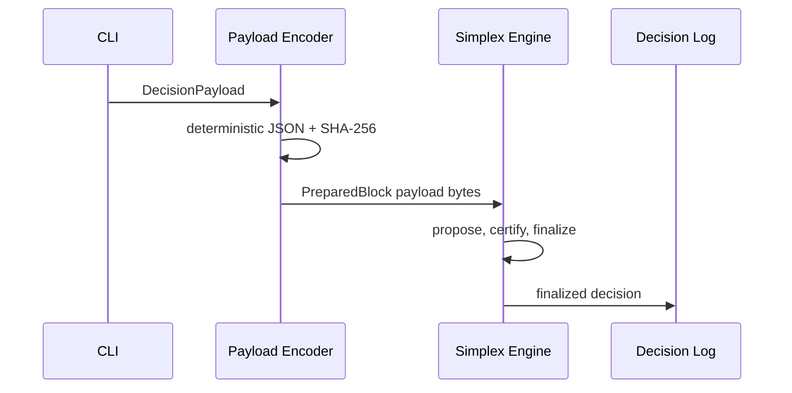

# 시각화 가이드

English version: `visualization.md`

## 목적

Consensus 문서는 message, vote, quorum certificate, finality 흐름이 보이지 않으면 이해하기 어렵습니다. 이 레포는 텍스트만으로 구현 방향이 흐려지는 지점에 시각 설명을 사용합니다.

## 기본: Mermaid

GitHub Markdown에서 바로 렌더링되는 Mermaid를 우선 사용합니다:

- architecture flowchart;
- sequence diagram;
- state machine;
- implementation roadmap;
- CI/CD pipeline.

예시:

## 애니메이션 Viz를 쓸 때

시간에 따른 행동을 관찰해야 이해되는 경우에만 animated artifact를 사용합니다:

- leader timeout 이후 view change;
- GST 전 message delay와 GST 이후 commit;
- DAG vertex 생성과 ordering;
- validator 사이 quorum 형성;
- fast path와 fallback path 전환.

예시 asset: [assets/finality-flow.svg](assets/finality-flow.svg)

## 형식

GitHub Markdown은 `.md` 안에서 임의 JavaScript를 실행하지 않습니다. 우선순위는 다음입니다:

1. 정적 diagram은 Mermaid.
2. 애니메이션은 `docs/assets/` 아래 GIF 또는 SVG.
3. interactive control이 필요하면 `docs/assets/` 아래 HTML 파일로 링크.

각 animated visualization은 다음을 함께 기록해야 합니다:

- 보여주는 scenario;
- validator count와 fault model;
- animation이 설명하는 metric;
- 대응되는 test 또는 benchmark command.
