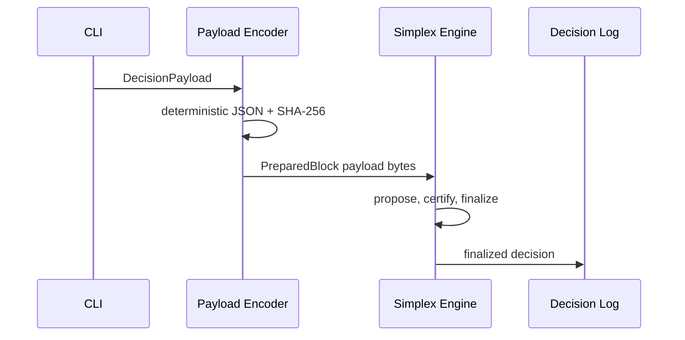

# Visualization Guide

Korean version: `visualization.ko.md`

## Why

Consensus documentation fails when readers cannot see the flow of messages, votes, quorum certificates, and finality. This repo uses visual explanations when text alone would hide the implementation direction.

## Default: Mermaid

Use Mermaid for diagrams that GitHub can render directly in Markdown:

- architecture flowcharts;
- sequence diagrams;
- state machines;
- implementation roadmaps;
- CI/CD pipelines.

Example:

## When To Use Animated Visuals

Use an animated artifact only when the reader needs to observe time-based behavior:

- view change after a leader timeout;
- message delay before GST and commit after GST;
- DAG vertex creation and ordering;
- quorum formation across validators;
- fast path vs fallback path switching.

Example asset: [assets/finality-flow.svg](assets/finality-flow.svg)

## Format

GitHub Markdown does not run arbitrary JavaScript inside `.md` files. Prefer:

1. Mermaid for static diagrams.
2. Animated GIF or SVG under `docs/assets/`.
3. A linked HTML file under `docs/assets/` when interactive controls are needed.

Each animated visualization should include:

- the scenario being shown;
- validator count and fault model;
- what metric the animation explains;
- the matching test or benchmark command.
